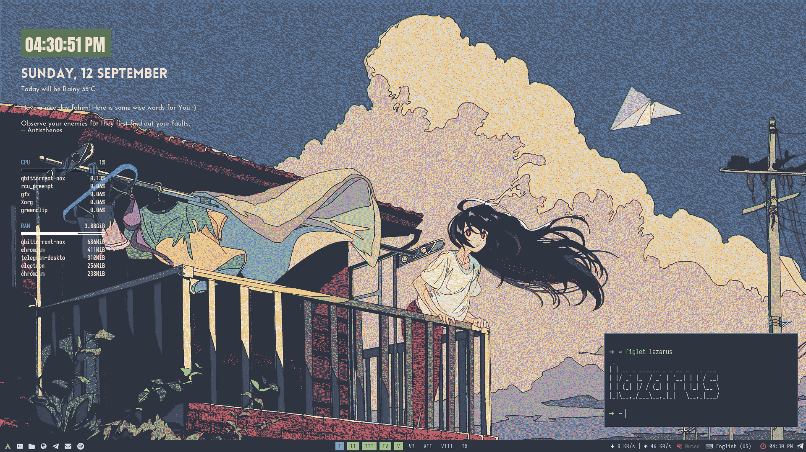

<div align="center">
    <h1>lazarus</h1>
    <p>This repo contains my dotfiles of Arch/bspwm setup</p>
    <p>
    
    <br><br>
    </p>
</div>

## Components

|                      | Package Name     |
| -------------------- | ---------------- |
| Window Mangaer       | bspwm            |
| Status Bar           | Polybar          |
| Application Launcher | Rofi             |
| Widgets              | Conky            |
| Shell                | zsh/fish         |
| Terminal             | Alacritty/Kitty  |
| Editor               | Neovim           |
| Notification Daemon  | Dunst            |
| Lock Screen          | betterlockscreen |
| Hotkey Daemon        | sxhkd            |
| Video Player         | mpv              |

## Pre-requisites

- Clean Arch installation (optional)
  
  > *It'll be easier for you to install the dotfiles if you use a new Arch installation.*

- bspwm

- [dotfiles](https://github.com/jbernard/dotfiles) package 
  
  > *to install and manage dotfiles*

- yay
  
  > to install AUR package

## Installation

> *For Arch only*

- Clone dotfiles repo.
  
  ```bash
  git clone https://github.com/fahimscirex/dotfiles ~/Dotfiles
  ```

- Move `dotfilesrc` to `home` directory. And necessary fonts to `~/.local/share/fonts`
  
  ```bash
  mv ~/Dotfiles/dotfilesrc "${HOME}/.dotfilesrc""
  cp -r ~/Dotfiles/fonts/* ~/.local/share/fonts/
  ```

- Install necessary packages.
  
  ```bash
  cat ~/Dotfiles/pkglist | yay -Syu -
  ```

- Set zsh as default shell and install `zgenom` 
  
  ```bash
  git clone https://github.com/jandamm/zgenom.git "${HOME}/.zgenom"
  chsh -s /usr/bin/zsh
  ```

- Install the dotfiles.
  
  ```bash
  cd ~/Dotfiles
  dotfiles -s --force
  ```

- Make scripts executable.
  
  ```bash
  chmod +x ~/{.bin/*,.config/bspwm/bspwmrc,.config/rofi/bin/*,.config/polybar/launch.sh,.config/conky/scripts/*}
  ```

## Keybindings

| Key                               | Description                              |
| --------------------------------- | ---------------------------------------- |
| ctrl + r                          | Reload bspwm                             |
| super + esc                       | Reload keybindings                       |
| super                             | App launcher                             |
| super + x                         | Powermenu                                |
| super + c                         | Close active window                      |
| super +[workspace number]         | Switch to workspace                      |
| ctrl + shift + [workspace number] | Move active window to specific workspace |
| super + return                    | Kitty                                    |
| super + shift + return            | Alacritty                                |
| Print                             | Copy a full screenshot                   |
| shift + Print                     | Copy a rectangular screenshot            |
| alt + Print                       | Save a full screenshot                   |
| ctrl + Print                      | Start screen record                      |
| ctrl + alt + Print                | Stop screen record                       |
| super + l                         | Lock screen                              |
| alt + space                       | Toggle between floating and tiled        |

> Check `~/.config/sxhkd/sxhkdrc` for all keybindings.

## Notes

> Fish will be the default shell for Alacritty and zsh will be the default user shell.

> I've edited `/etc/lxdm/Xsession` per my needs. If your DM uses `.xinitrc` or `.xsession` by default, you won't have to edit Xsession.

> Use your own OpenWeather API and city ID in conky config.

> Don't install dotfiles without checking them. Check the dotfiles first, modify it and then proceed to installation.  
